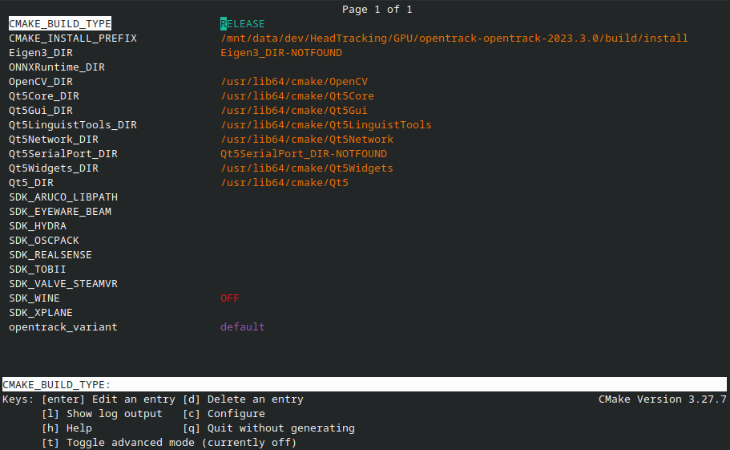
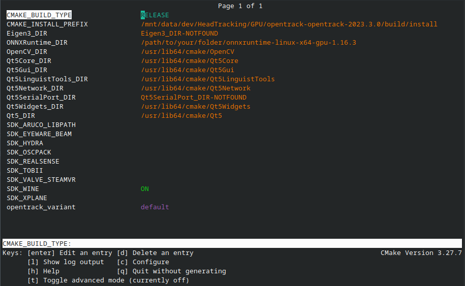

# Headtracking with Opentrack+Neuralnet input on Linux
This walkthough should help you get started with headtracking on Linux with any webcam. Since Opentrack does not provide prebuild version for Linux and usually distro's repositories do not provide it neither, we will have to build it from source in a way, that it supports neuralnet input and wine output.

## Disclaimer
This was tested only on my machine. Keep it in mind and change the instructions accordingly to your needs.

## Set up
1. Install [`wine-devel`](https://wiki.winehq.org/Download).
    - Make sure you install development branch. Stable branch does not have necessary headers and Opentrack won't compile.
2. Get [Opentrack](https://github.com/opentrack/opentrack/releases) source code of latest release
    - Does not matter if it is `.zip` or `.tar.gz` as long as you can unpack it.
3. Get [ONNXRuntime](https://github.com/microsoft/onnxruntime/releases).
    - Both `onnxruntime-linux-x64-x.x.x.tgz` and `onnxruntime-linux-x64-gpu-x.x.x.tgz` should work. If not sure, grab the first one.
4. Install dependencies required to [build Opentrack](https://github.com/opentrack/opentrack/wiki/Building-on-Linux).
    - It is the official Opentrack wiki that also contains instruction how to build Opentrack. You can follow it if you want, but I will provide more detail instruction here as well.
5. Make a folder and copy both downloaded archives there.
    - Once you are done with this guide, you won't be able to move or remove this folder without breaking Opentrack. Place it somewhere you won't mind it being.
6. Unpack both archives.
    - You should have two folders now: `onnxruntime-linux-x64-x.x.x` and `opentrack-opentrack-x.x.x`.

## Build Opentrack
1. Open terminal in `opentrack-opentrack-x.x.x` folder.
2. Execute `mkdir build && cd build`
3. Execute `cmake ..`
4. Execute `ccmake .`
    - This will open CMake GUI. You can navigate it with arrow keys, `enter` to edit a field, `c` to save change and `q` to exit.
5. Navigate to `SDK_WINE` and press `enter` to turn it `ON`.
6. Navigate to `ONNXRuntime_DIR` and press `enter` to edit it.
    - Enter path to `onnxruntime-linux-x64-x.x.x` folder. Use absolute path.
7. Press `c` to configure. Press `e` to exit configuration once it is done.
8. Press `q` to exit `ccmake`.
9. Execute `make install -j`
    - This will take a while.
10. Execute `cd install/bin`
11. Execute `./opentrack` to run Opentrack.
    - If everything went well, Opentrack should start. Check if input dropdown has a option `neuralnet tracker` and output dropdown has a option `Wine -- Windows layer for Unix`.
12. Follow instruction in [here](./Tips-and-Tricks.md#head-tracking-using-opentrack) to finish setting up Opentrack.
    - It is highly recommended to bind `Center` and `Toggle tracking` in Opentrack options. Check out mapping too.
13. Select `neuralnet tracker` as input and `Wine -- Windows layer for Unix` as output.
14. Press `Start` and check if Opentrack is working.
    - If everything went well, you should see a window with your webcam feed with some tracking information on top of it.

_Note: If you messup something in `ccmake` and you find out after step 9, execute `make clean` and start from step 4. Or delte buld folder and start over._

### ccmake example
|Before|After|
|:---:|:---:|
|||

### Extra
#### Making application launcher shortcut
To run Opentrack you will have to navigate to `opentrack-opentrack-x.x.x/build/install/bin` and execute `./opentrack` every time. To make it easier, you can create a `opentrack.desktop` file in `~/.local/share/applications` with following content:
```
[Desktop Entry]
Type=Application
Name=Opentrack
Exec=/path/to/your/folder/opentrack-opentrack-x.x.x/build/install/bin/opentrack
Icon=/path/to/your/folder/opentrack-opentrack-x.x.x/opentrack/opentrack.ico
Comment=Opentrack
Categories=Utility;Application;
Terminal=false
```
This way Opentrack should show up in your application launcher.

#### Changing installation folder
If want different installation location, you can change `CMAKE_INSTALL_PREFIX` in `ccmake` to whatever you want. Just make sure you use absolute path. After that, you can delete folder with Opentrack source code. But you can't delete ONNXRuntime folder, or Neuralnet input won't work.

If you want to be well behaving Linux user, make the whole installation into `~/.local/` folder or other place dedicated to user's programs.
1. Copy `lib` and `include` folders from `onnxruntime-linux-x64-x.x.x` to `~/.local/`
2. In `ccmake` change `CMAKE_INSTALL_PREFIX` to `/home/USER/.local/`
3. In `ccmake` change `ONNXRuntime_DIR` to `/home/USER/.local/`
4. Continue with [Build Opentrack](#build-opentrack) from step 7.

Don't forget to change your `opentrack.desktop` file accordingly.

### Known issues
If your webcam does not show up in Opentrack, turn off Opentrack, unplug your webcam, plug it back in and turn Opentrack back on. This should fix the issue.